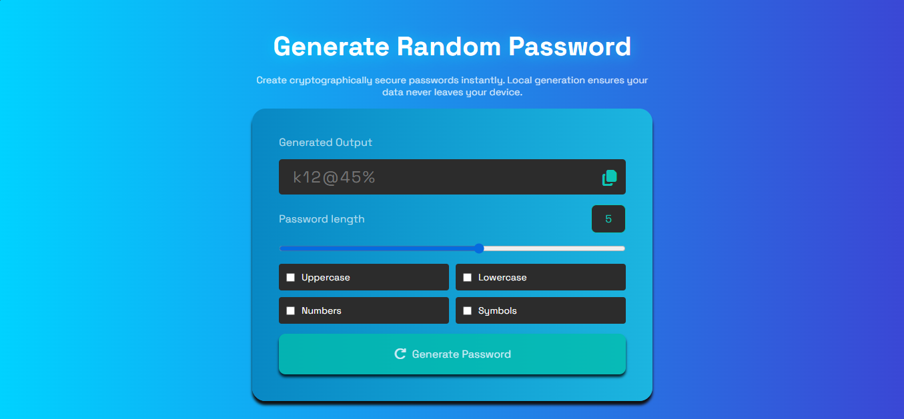
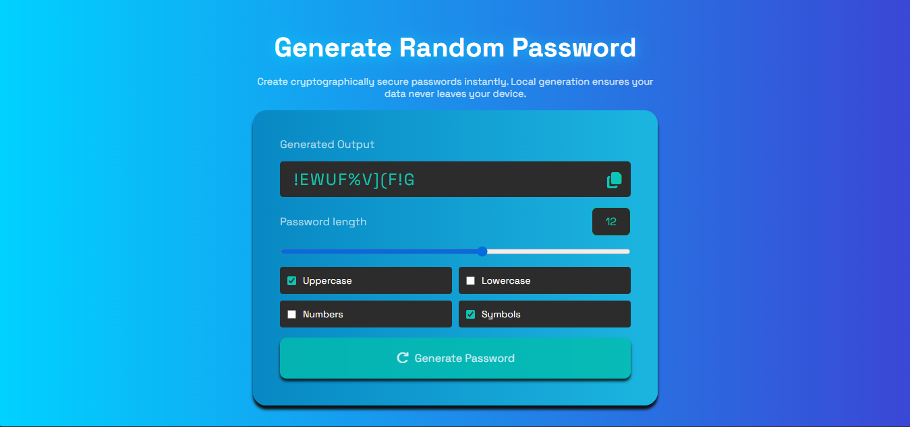

# Random Password Generator  
[**🌐 Check Website**](https://gausha606.github.io/Random-Password-Generator.github.io/)

A simple password generator to get random password whenever you click on generate password.

## 🚀 Features

- Real time password generator.
- Copy this password to paste it anywhere.
- Simple and Sweet design.
- You can customize according your preferences like uppercase, lowercase, numbers or special characters.

## Description

### A simple but professional password generator. Let's assume you are signing Up other website like when you just need password to log in so you can use it this generator.

## 🛠️ Tech Stack

| Technology     | Use Case                           |
| :------------- | :--------------------------------- |
| **HTML5**      | For structure and semantic layout. |
| **CSS3**       | For design and styling.            |
| **JavaScript** | For generating random password.    |

## 📦 Installation & Setup

Project ko local machine par chalane ke liye niche diye gaye steps follow karein:

Repository Clone karein:

```Bash
git clone https://github.com/Gausha606/Random-Password-Generator.git
```

Project Folder mein jayein:

```Bash
cd Random-Password-Generator
```

Run karein:
`index.html` file ko browser mein open karein (Preferably using Live Server).

---

## 📁 Project Structure

```text
├── index.html          # Main HTML structure
├── style.css           # Styling aur Animations
├── script.js           # Password generate logic with copy functionality
└── README.md           # Project Documentation
```

## 📸 Screenshots


